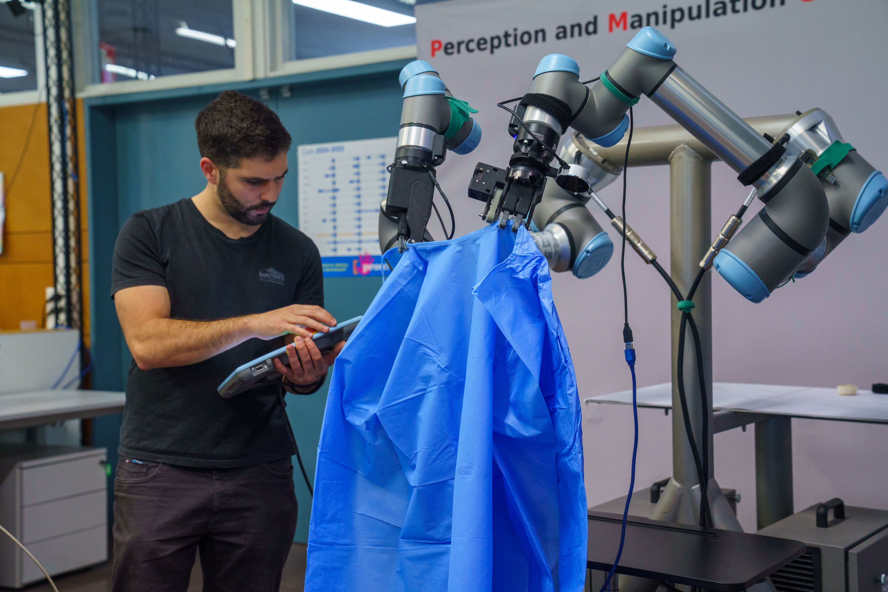
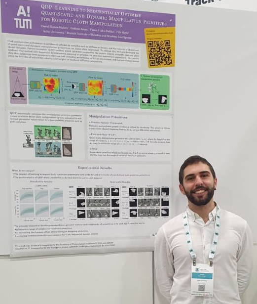
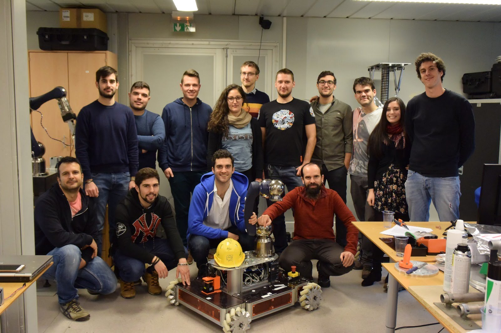
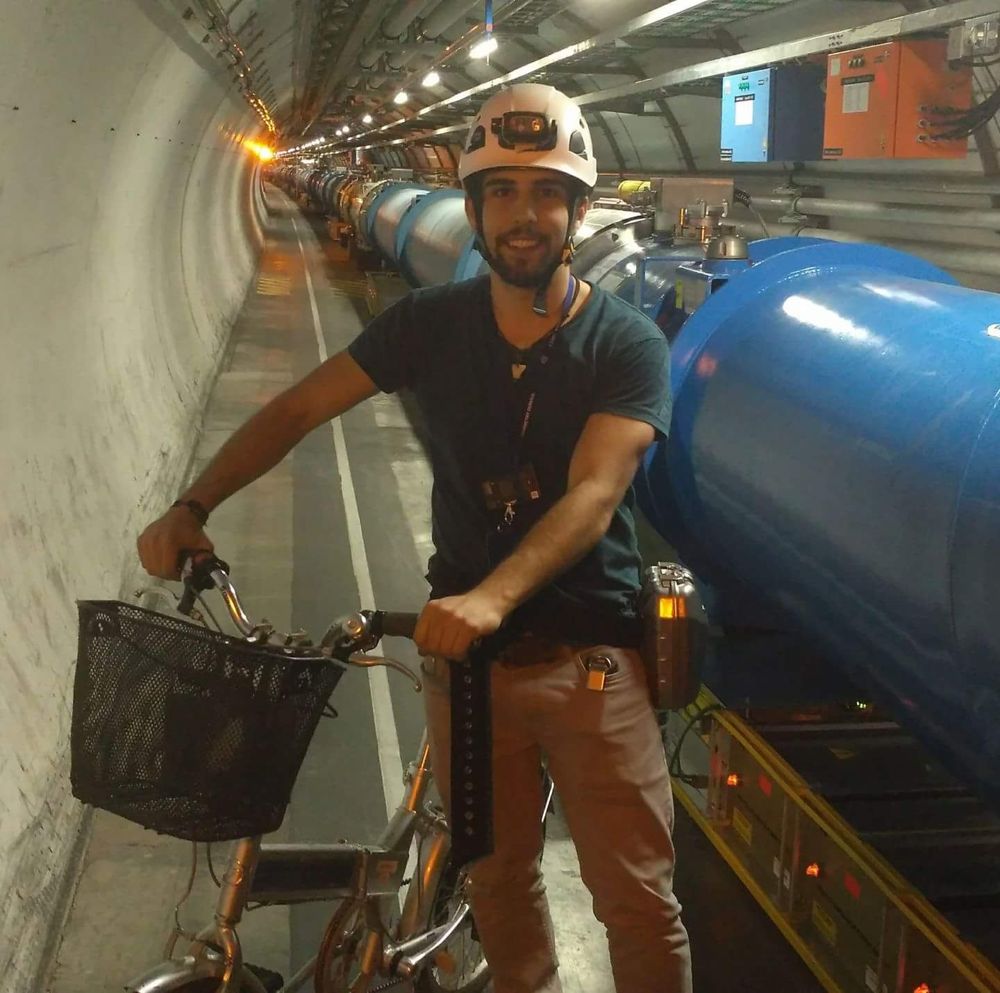
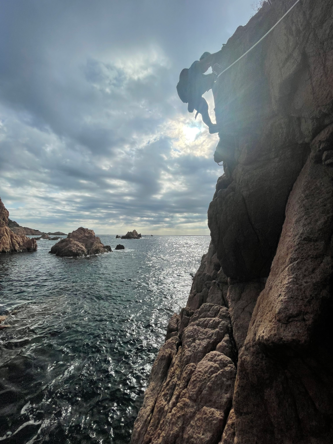

My name is David Blanco Mulero and I'm an incoming Assistant Professor at the [Universitat Politècnica de Catalunya](https://upc.edu/) (UPC), in the [ESAII](https://esaii.upc.edu/) department.

Prior to that, I was a Postdoc at the [Institut de Robòtica i Informàtica Industrial](https://www.iri.upc.edu/), CSIC-UPC, at the Perception and Manipulation group led by Prof. [Carme Torras](http://www.iri.upc.edu/people/torras).
My postdoctoral work focused on transferring techniques for manipulating deformable objects to real-world settings.
As part of the EU [SoftEnable](https://softenable.eu/) project, I developed methods to autonomously manipulate medical garments to assist hospital personnel.
Aditionally, in early 2026 I completed a research visit at the [Institute of Robotics and Mechatronics](https://www.dlr.de/en/rm) at the German Aerospace Center (DLR), funded by the [José Castillejo mobility grant](https://www.ciencia.gob.es/Convocatorias/2024/JoseCastillejo2024) from the Spanish Ministry of Science.

I'm did my PhD Thesis at Aalto University [Intelligent Robotics group](https://irobotics.aalto.fi/) supervised by Prof. [Ville Kyrki](https://www.aalto.fi/en/people/ville-kyrki).
My PhD Thesis "[_Towards Efficient Robotic Manipulation of Deformable Objects by Learning Dynamics Models and Adaptive Policies_](../assets/pdf/2024_DBM_Thesis.pdf)"
focused on bridging the gap in the adaptive capabilities of robotic systems to manipulate deformable objects.
My PhD Thesis combines techniques such as Reinforcement Learning, Graph Neural Networks and Gaussian Processes
to develop methods that can learn to manipulate deformable objects in simulation and transfer the learnt skills
to the real-world.

During my PhD I was part of multiple projects of the Academy of Finland: the AI Spider Silk Threading (ASSET) project and the B-REAL project,
as well as the Business Finland project SANTTU. I also collaborated actively with industry with partners such as
[Cargotec](https://www.hiabgroup.com/en/) or [Sandvik](https://www.home.sandvik/en/).

During my PhD I received the [Nokia PhD Scholarship](https://nokiafoundation.com/nokia-scholarship/) grant
(5000 Euros) to encourage the work carried out during my PhD thesis, and the 
[Foundation for Aalto University Science and Technology](https://www.aalto.fi/en/foundation-for-aalto-university-science-and-technology)
Research Visit Travel Grant (3100 Eur) for doing a research visit at IRI-CSIC-UPC.

Before that, I received my MSc in Automation and Robotics at the Universidad Politecnica de Madrid (Spain).
I did my  MSc Thesis at CERN (2016), where I worked developing a [collision avoidance system](https://doi.org/10.1145/3068796.3068800) 
for the robotic platform [CERNTAURO](https://ieeexplore.ieee.org/document/8391705).

After that, I worked at CERN as a Technical student (2017-2018) in the EN-STI-ECE group (currently EN-SMM-MRO).
During that time I worked on SLAM techniques for performing visual inspection in the accelerators.
I also worked on developing a new mobile robotic platform as well as performing interventions in the accelerators.

In 2018 I joined Dyson algorithm's team. 
During my year at Dyson I continued working on topics related to autonomous navigation and mobile robotic platforms.
That year Dyson released the Dyson 360 Heurist, 
which is one of the projects I worked on.

After my time in industry and working close to research, I decided to step up and move to Academia.

On my free time, aside of electronic and ML projects, I really enjoy climbing.
I started bouldering on 2019 and doing lead climbing on 2022.

Here one of my photos doing a via ferrata :)

